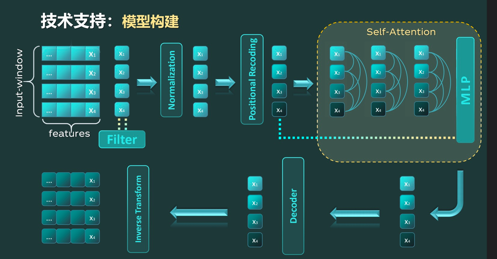

# TST-Lite for Anomaly Detection


TST-Lite 🚀 is a better and more efficient way to detect anomalies in time series data with Attention-based Learning.


## Architecture



## Directory Structure

```shell
.
├── Dockerfile              # Dockerfile打包Docker镜像
├── README.md               # 说明文档
├── app.py                  # Flask入口
├── asset
│   └── img.png             # TST-Lite 流程图
├── dataset                 # 数据集
├── model                   # 模型目录
├── requirements.txt        # 依赖包
├── self_check.py           # 实现自检功能
├── train.py                # 训练模型的封装
└── utils                   # 工具
    ├── data_prepare.py     # 数据准备
    ├── eval.py             # 评估模型
    ├── for_overview.py     # 提取概述信息
    ├── plot_and_loss.py    # 绘制 loss 图像
    └── train.py            # 训练模型
```


## Quick Start

1. first, run the following command to generate `requirements.txt`
```shell
pipreqs ./ --encoding=utf8 --force
```


2. install essential packages
```shell
pip install -r requirements.txt
```

3. change the config for your environment

4. run the `app.py`
```shell
python app.py
```

## Docker
```shell
docker run -it -d -p 5001:5001 --name tst-lite cocoshe/ts:api
```

## Link backend services api
Use golang for some services routes, click [here](https://github.com/cocoshe/yuheng)

